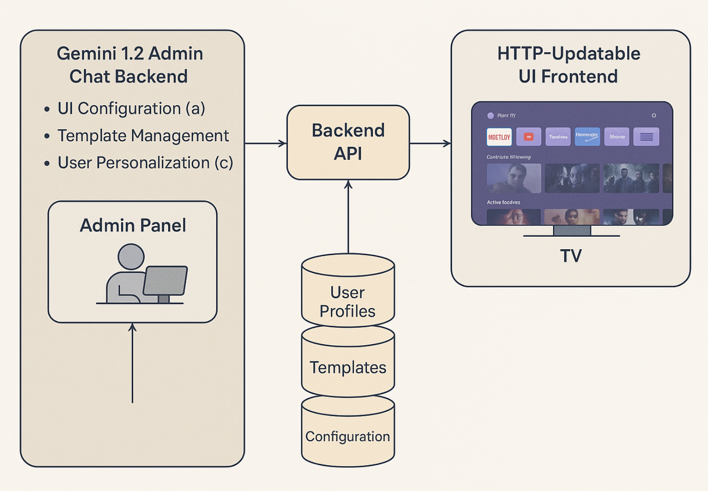

# Horizon TV - Smart TV Launcher Demo

This is a simple FastAPI + HTML/JS demo that simulates the Horizon TV launcher UI platform. It includes:

- A Python backend (FastAPI) that serves and updates UI layout configurations
- A lightweight frontend (`index.html`) that renders the layout dynamically
- Persistent layout storage via JSON file (`ui_config.json`)




---

## 🧰 Features

- REST API to GET and POST UI configuration
- Editable layout rows (titles and app names)
- Frontend auto-fetches layout and renders launcher view
- Data persistence using local JSON

---

## 🚀 Getting Started

### 1. Clone and Install

```bash
git clone https://github.com/your-org/horizon-tv-launcher.git
cd horizon-tv-launcher

# Setup Python environment
python3 -m venv venv
source venv/bin/activate

# Install dependencies
pip install fastapi uvicorn
```

### 2. Run the Backend Server

```bash
uvicorn main:app --reload
```

This will start the API at [http://localhost:8000/config](http://localhost:8000/config)

---

### 3. Launch the UI

Simply open `index.html` in your browser (double-click or use):

```bash
open index.html   # macOS
xdg-open index.html  # Linux
```

---

## 🛠 Files

| File             | Description                         |
|------------------|-------------------------------------|
| `main.py`        | FastAPI backend                     |
| `index.html`     | Frontend launcher UI                |
| `ui_config.json` | Local config file for layout state  |

---

## 🔄 API Endpoints

### `GET /config`

Returns current layout config

### `POST /config`

Updates layout with payload:

```json
{
  "theme": "dark",
  "rows": [
    { "title": "Favorites", "apps": ["YouTube", "HBO", "Spotify"] }
  ]
}
```

---

## 📌 License

© 2025 Alpha Labs. All rights reserved.
